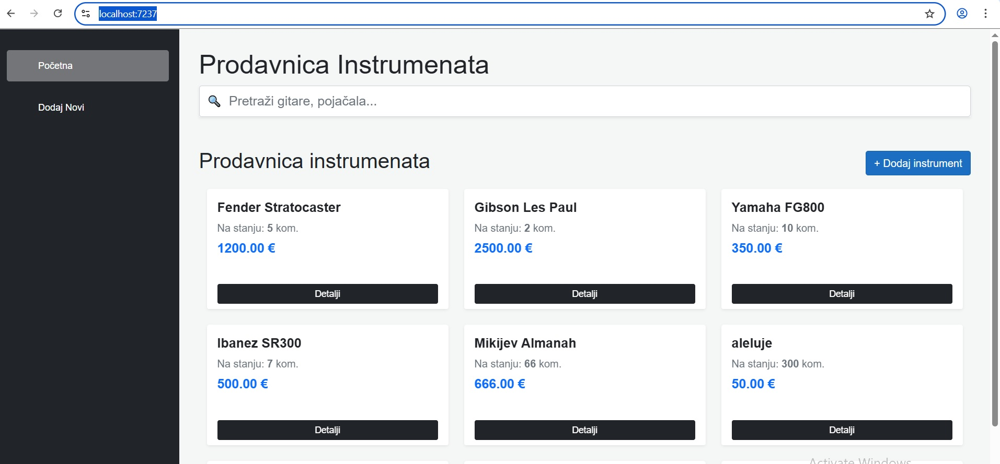
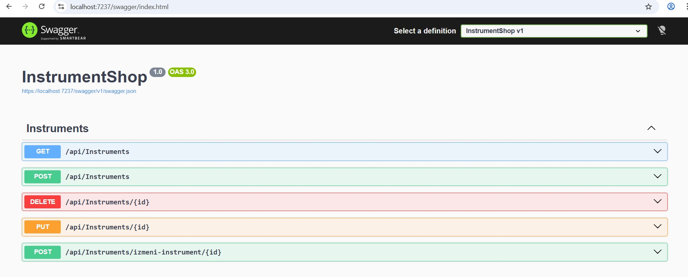
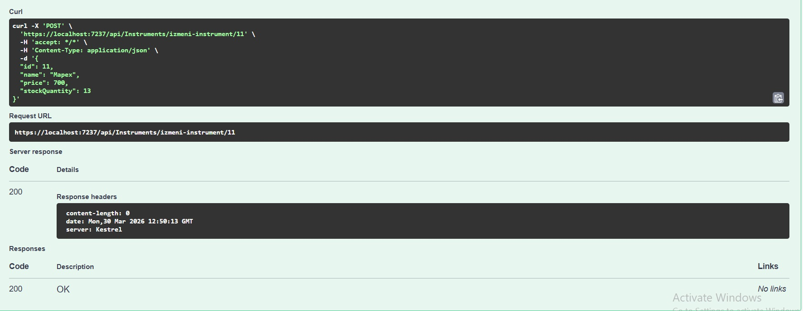
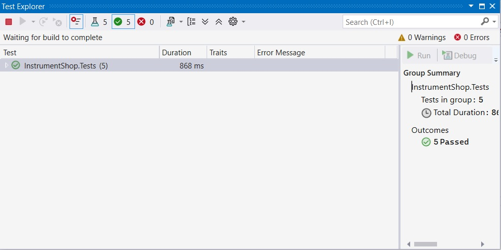

## Instrument Shop (Full-Stack .NET System)

A comprehensive business process management module developed as a Full-Stack .NET application. This project demonstrates high-level architecture, automated testing, and integration with third-party simulated services.

🚀 Technologies Used
Backend: ASP.NET Core Web API, .NET Core 8

Frontend: Blazor WebAssembly, Bootstrap 5, JavaScript (Interop)

Database: SQL Server, Entity Framework Core

Testing: xUnit, Moq (Mocking Framework)

Architecture: Clean Architecture, Repository Pattern, Service Layer

🛠 Key Features & Achievements
1. Advanced Architecture & Separation of Concerns
Implemented the Repository Pattern and a dedicated Service Layer to ensure a clean separation of logic. This architecture facilitates easy maintenance and scalability, following SOLID principles.

2. Automated Testing (QA & Reliability)
Developed a robust suite of Unit Tests using xUnit and Moq.

Validation of core business logic.

Controller Testing: Validating ModelState and HTTP response codes.

Mocking: Simulating asynchronous database operations and external services to ensure isolated and deterministic tests.

3. API Services & Third-Party Integration
Designed a RESTful API with advanced data validation using Data Annotations.

Currency Service: Implemented a service that simulates real-time currency conversion, mimicking integration with SOAP/REST third-party systems.

4. Performance Optimization & Monitoring
Async/Await: Applied asynchronous programming across the entire stack for non-blocking data fetching and improved server scalability.

Read-Only Optimization: Used .AsNoTracking() in Entity Framework Core for high-performance data retrieval, significantly reducing memory overhead by bypassing change tracking.

Scalable Validation: Integrated FluentValidation to implement strict business rules and data integrity checks, decoupling validation logic from the data models.

Structured Logging: Integrated the ILogger interface to track critical operations (e.g., data deletion), enabling easier diagnostics and system auditing in production environments.

5. Frontend Interactivity
Built a responsive UI in Blazor WebAssembly with Bootstrap.

Dynamic Search: Real-time filtering using oninput events.

JS Interop: Used JavaScript for client-side confirmations and DOM manipulation to enhance UX.

📸 Screenshots

### Dashboard

### API Documentation

### Successful Data Update Example

### Test Explorer

📂 How to Run
Clone the repository.

Update the appsettings.json with your SQL Server connection string.

Run dotnet ef database update to create the database.

Run the solution in Visual Studio.
